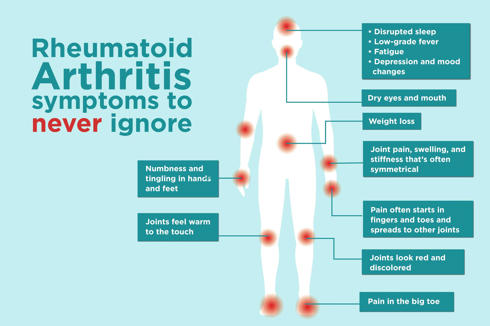

# Transcriptomics Casus

  

## Inhoud/structuur

- `Bam bestanden/` - reads dat gemapt zijn tegen referentiegenoom  
- `bronnen/` - gebruikte bronnen -> note: toevoegen NCBI in wordt document
- `RScripts/` – Rscript waar alle data wordt verwerkt 
- `resultaten/` - grafieken en tabellen
- `Ruwe Data/` – Hierin zit de data van de Patiënten met en zonder Reumatoïde Atritis (RA).
- `assets/` - overige documenten voor de opmaak van deze pagina
- `README.md` - Is het document waar het verslag (de tekst) in wordt gemaakt. 

---

## Inleiding

Reumatoïde artritis (RA) is een chronische, systematische auto-immuunziekte waarbij het immuunsysteem het eigen lichaam aanvalt. De exacte oorzaak is nog onbekend, maar vermoedelijk speelt een combinatie van genetische aanleg, omgevingsfactoren en een ontspoord immuunsysteem een rol [Gabriel, 2001](Bronnen/gabriel2001.pdf). Een belangrijk kenmerk van RA is synovitis: een ontsteking van het gewrichtsslijmvlies, wat leidt tot pijn, zwelling en uiteindelijk gewrichtsschade [Radu & Bangua, 2021](Bronnen/cells-10-02857-v2.pdf). Vroege opsporing en behandeling kunnen schade beperken, maar genezing is (nog) niet mogelijk.

In dit project is RNA-sequencing toegepast op synoviumbiopten van zowel gezonde personen als patiënten met RA (gevestigde diagnose >12 maanden), met als doel het identificeren van verschillen in genexpressie en betrokken biologische processen. De analyse is uitgevoerd in [Rstudio](RScripts/ProjectRA.R) en omvat onder meer differentiële expressieanalyse en functionele verrijkingsanalyse op basis van Gene Ontology (GO) en KEGG-pathways.

De gebruikte brondata en artikelen zijn te vinden in de folder [bronnen](Bronnen). 

## Methoden

Voor deze studie is RNA-sequencing data geanalyseerd van synoviumbiopten van gezonde controles en patiënten met reumatoïde artritis (RA).

*Figuur 1: flowschema van dataverwerking in R. nog maken*

#### Verkregen data

De RNA-sequencing data zijn verkregen uit synoviumbiopten van 4 patiënten met RA en 4 gezonde controles. Bij de RA-patiënten is de diagnose bevestigd door de aanwezigheid van anti-CCP autoantistoffen. Een overzicht van de data is te vinden in  ruwe data link(data link ruwe data).

#### Mappen van data en countmatrix 
De ruwe sequencingbestanden (FASTQ-formaat) zijn opgeslagen in de map [Ruwe Data](Ruwe%20Data). Voor de uitlijning is het humane referentiegenoom [GRCh38 (GCF_000001405.40, versie GRCh38.p14)](https://www.ncbi.nlm.nih.gov/datasets/genome/GCF_000001405.40/) van NCBI gebruikt. Vanwege de grootte van het genoom is het FASTA-bestand niet opgenomen in de repository, maar kan via NCBI worden gedownload via accessionnummer GCF_000001405.40.

De referentie-index is opgebouwd met het R-pakket Rsubread (versie 2.20.0) met voldoende geheugen (4 GB) om de indexbestanden te splitsen. De sequencing reads zijn uitgelijnd met de functie align(), waarna de resulterende BAM-bestanden gesorteerd en geïndexeerd zijn met Rsamtools. De genexpressie is geteld met featureCounts(), waarbij gebruik is gemaakt van de GTF-annotatie Homo_sapiens.GRCh38.114.chr.gtf.gz van ENSEMBL.

Differentiële expressieanalyse is uitgevoerd met DESeq2, waarbij het model ~ treatment (controle vs. RA) is toegepast. Resultaten zijn gevisualiseerd met EnhancedVolcano en geanalyseerd met goseq en pathview om biologische functies en pathways te identificeren.

#### Statistische analyse
De gegenereerde countmatrix (data/count_matrix.txt) en een behandel-tabel met controle- en RA-status zijn ingeladen in DESeq2 (versie 1.46.0) om differentiële genexpressie te berekenen. Hierbij zijn log₂ fold changes, p-waarden en meervoudige testcorrecties (Benjamini-Hochberg) bepaald. Resultaten zijn gevisualiseerd in een volcano plot (log₂ fold change vs. significatie). Daarnaast is functionele verrijkingsanalyse uitgevoerd met goseq voor Gene Ontology en met pathview voor KEGG pathway-analyse.

## Resultaten

De analyse van de RNA-seq data toonde duidelijke verschillen in genexpressie tussen reumatoïde artritis (RA)-patiënten en gezonde controles. In totaal werden 102 genen met verhoogde expressie (log₂FC > 1, padj < 0.05) en 88 genen met verlaagde expressie (log₂FC < -1, padj < 0.05) geïdentificeerd. De volledige lijst van significante genen is beschikbaar in [ResultatenRA](Resultaten/ResultatenRA.csv)

De [volcano](Resultaten/Plots/VolcanoplotRA.png) plot toont een duidelijke scheiding tussen genen met verhoogde en verlaagde expressie in RA-patiënten. Genen met de meest significante expressieveranderingen (padj < 0.05) vallen op door hun sterke betrokkenheid bij ontstekingsgerelateerde processen.

Vervolgonderzoek met [GO-enrichmentanalyse](Resultaten/Plots/Rplot02.png) toonde een significante oververtegenwoordiging van biologische processen die samenhangen met het immuunsysteem, waaronder ‘T cel activatie’ en ‘cytokine-mediated signaling’ . [KEGG-pathwayanalyse](Resultaten/hsa03260.png) suggereerde dat vooral routes zoals ‘T cell receptor signaling’ en ‘cytokine-cytokine receptor interaction’ betrokken zijn bij RA.

## Conclusie

Deze studie toont aan dat RNA-sequencing van synoviumbiopten verschil in genexpressie kan onthullen tussen RA-patiënten en gezonde controles. vooral genen betrokken bij immuunrespons en ontsteking vertoonden sginificante regulatie, wat het ontstekingskarakter van RA onderstreept en aansluit bij de klinische kenmerken van synovitis.

de verrijkingsanalyse via GO en KEGG benadrukte het belang van immuunactivatie, cytokinesignalering en celadhesie in RA-pathologie. deze inzichten dragen bij aan een beter begrip van de mechanismen achter RA en kunnen richting geven aan de ontwikkeling van biomarkers en gerichte therapieën. 

voor toekomstig onderzoek wordt aanbevolen om deze resultaten te valideren in grotere hoeveelheden met aanvullende experimenten, om de klinische relevantie verder te onderbouwen.

