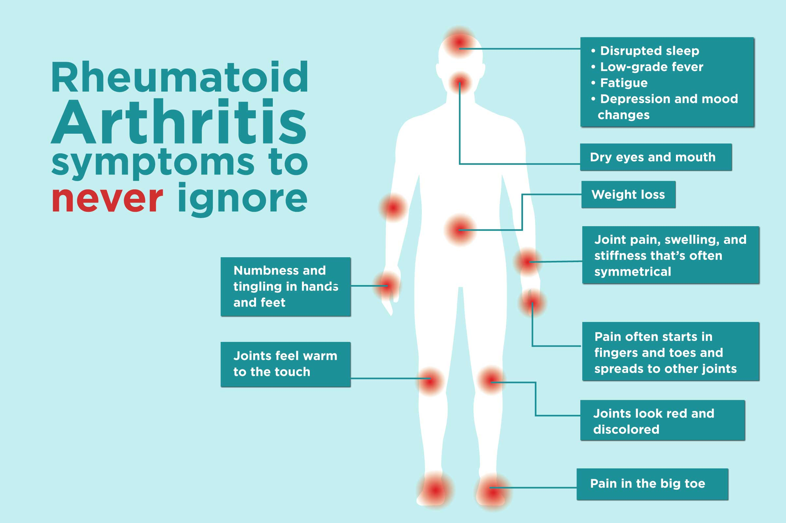
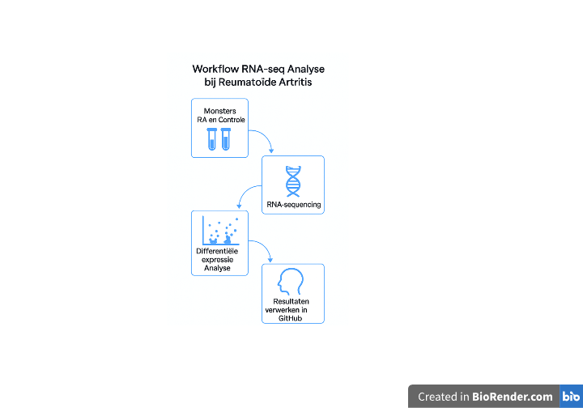

# Transcriptomics Casus: Genexpressieanalyse bij Reumatoïde Artritis

  

## Inhoud/structuur

- `Bam bestanden/` - reads dat gemapt zijn tegen referentiegenoom  
- `bronnen/` - gebruikte bronnen 
- `RScripts/` – Rscript waar alle data wordt verwerkt 
- `resultaten/` - grafieken en tabellen
- `Ruwe Data/` – Hierin zit de data van de Patiënten met en zonder Reumatoïde Atritis (RA).
- `assets/` - overige documenten voor de opmaak van deze pagina
- `README.md` - Is het document waar het verslag (de tekst) in wordt gemaakt. 

---

## Inleiding

Reumatoïde artritis (RA) is een chronische, systemische auto-immuunziekte waarbij het immuunsysteem het eigen lichaam aanvalt. De exacte oorzaak is nog onbekend, maar vermoedelijk speelt een combinatie van genetische aanleg, omgevingsfactoren en een ontspoord immuunsysteem een rol [Gabriel, 2001](Bronnen/gabriel2001.pdf). Een belangrijk kenmerk van RA is synovitis: een ontsteking van het gewrichtsslijmvlies, wat leidt tot pijn, zwelling en uiteindelijk gewrichtsschade [Radu & Bangua, 2021](Bronnen/cells-10-02857-v2.pdf). Vroege opsporing en behandeling kunnen schade beperken, maar genezing is (nog) niet mogelijk.

In dit project is RNA-sequencing toegepast op synoviumbiopten van zowel gezonde personen als patiënten met RA (vastgestelde diagnose >12 maanden), met als doel het identificeren van verschillen in genexpressie en betrokken biologische processen. De analyse is uitgevoerd in [Rstudio](RScripts/ProjectRA.R) en omvat onder meer differentiële expressieanalyse en functionele verrijkingsanalyse op basis van Gene Ontology (GO) en KEGG-pathways.

De gebruikte brondata en artikelen zijn te vinden in de folder [bronnen](Bronnen). 

## Methoden

Voor deze studie is RNA-sequencing data geanalyseerd van synoviumbiopten van gezonde controles en patiënten met reumatoïde artritis (RA).

  

_Figuur 1: flowschema van dataverwerking in R._

#### Verkregen data

De RNA-sequencing data zijn verkregen uit synoviumbiopten van 4 patiënten met RA en 4 gezonde controles. Bij de RA-patiënten is de diagnose bevestigd door de aanwezigheid van anti-CCP autoantistoffen. Een overzicht van de data is te vinden in de ruwe data link.

_Tabel 1. overzicht van de gebruikte samplemetadata in deze studie._

| Monster ID            | Leeftijd | Geslacht    | Conditie                             |
|-----------------------|----------|-------------|--------------------------------------|
| SRR4785819            | 31       | Vrouw       | Normaal                              |
| SRR4785820            | 15       | Vrouw       | Normaal                              |
| SRR4785828            | 31       | Vrouw       | Normaal                              |
| SRR4785831            | 42       | Vrouw       | Normaal                              |
| *Gemiddelde leeftijd* | *29.8*   | –           | *Normaal*                            |
| SRR4785979            | 54       | Vrouw       | Rheumatoid arthritis (Vastgesteld)   |
| SRR4785980            | 66       | Vrouw       | Rheumatoid arthritis (Vastgesteld)   |
| SRR4785986            | 60       | Vrouw       | Rheumatoid arthritis (Vastgesteld)   |
| SRR4785988            | 59       | Vrouw       | Rheumatoid arthritis (Vastgesteld)   |
| *Gemiddelde Leeftijd* | *59.8*   | –           | *Rheumatoid arthritis (Vastgesteld)* |

#### Mappen van data en countmatrix 
De ruwe sequencingbestanden (FASTQ-formaat) zijn opgeslagen in de map [Ruwe Data](Ruwe%20Data). Voor de uitlijning is het humane referentiegenoom GRCh38 (GCF_000001405.40, versie GRCh38.p14) van NCBI gebruikt. Vanwege de grootte van het genoom is het FASTA-bestand niet opgenomen in de repository, maar kan via NCBI worden gedownload via accessionnummer [GCF_000001405.40](https://www.ncbi.nlm.nih.gov/datasets/genome/GCF_000001405.40/).

De referentie-index is opgebouwd met het R-pakket Rsubread (versie 2.20.0) met voldoende geheugen (4 GB) om de indexbestanden te splitsen. De sequencing reads zijn uitgelijnd met de functie align(), waarna de resulterende BAM-bestanden gesorteerd en geïndexeerd zijn met Rsamtools (Versie 2.14.0). De genexpressie is geteld met featureCounts(), waarbij gebruik is gemaakt van de GTF-annotatie Homo_sapiens.GRCh38.114.chr.gtf.gz van ENSEMBL.

Differentiële expressieanalyse is uitgevoerd met DESeq2 (Versie 1.46.0), waarbij het model ~ treatment (controle vs. RA) is toegepast. Resultaten zijn gevisualiseerd met EnhancedVolcano (Versie 1.18.0), en geanalyseerd met goseq (Versie 1.52.0) en pathview (Versie 1.38.0) om biologische functies en pathways te identificeren.

#### Statistische analyse
De gegenereerde countmatrix (data/count_matrix.txt) en een behandel-tabel met controle- en RA-status zijn ingeladen in DESeq2 (versie 1.46.0) om differentiële genexpressie te berekenen. Hierbij zijn log₂ fold changes, p-waarden en meervoudige testcorrecties (Benjamini-Hochberg) bepaald. Resultaten zijn gevisualiseerd in een volcanoplot (log₂ fold change vs. significantie). Daarnaast is functionele verrijkingsanalyse uitgevoerd met goseq voor Gene Ontology en met pathview voor KEGG pathway-analyse.

## Resultaten

### Differentiële genexpressieanalyse 
Om genen te identificeren die verschillend tot expressie kwamen tussen RA-patiënten en gezonde controles, werd een RNA-seq analyse uitgevoerd met DESeq2. In totaal werden 102 genen met verhoogde expressie (log₂FC > 1, padj < 0.05) en 88 genen met verlaagde expressie (log₂FC < -1, padj < 0.05) geïdentificeerd. De volledige lijst van significante genen is beschikbaar in [ResultatenRA](Resultaten/ResultatenRA.csv).

De [Volcano Plot](Resultaten/Plots/Resultaten/Plots/VolcanoplotRA.png)  toont de verdeling van alle 29.407 onderzochte genen op basis van Log2 fold change en -log10 p-waarde. Meerdere genen zijn significant op- of neerwaarts gereguleerd. Opvallende genen zijn onder andere ANKRD30BL, MT-ND6, SLC9A3R2, en ZNF598, evenals immuungerelateerde genen zoals IGHV1-69, IGHV4-31, ADAMTS6, BCL2A1 en ZNF598. Deze genen spelen een rol in immuunactivatie en ontstekingsprocessen, wat kenmerkend is voor RA.

### GO-enrichmentanalyse
Om de biologische betekenis van de differentieel tot expressie gebrachte genen te achterhalen, werd een [GO-enrichmentanalyse](Resultaten/Plots/Resultaten/Plots/Rplot.png) uitgevoerd. De analyse laat zien dat dat genen die betrokken zijn bij intracellulaire structuren (zoals nucleoplasm en organelle lumen) en immuunprocessen sterk verrijkt zijn. Dit wijst erop dat RA gepaard gaat met veranderingen in nucleaire functies en een verhoogde immuunactiviteit, wat goed aansluit bij het ontstekingskarakter van de ziekte.

### KEGG-pathwayanalyse
De [KEGG-pathwayanalyse](Resultaten/Plots/Resultaten/Plots/hsa05323.pathview.png) toont aan dat de reumatoïde pathway significant beïnvloed is. Belangrijke inflammatoire mediatoren zoals TNF,IL6 en apoptose-gerelateerde genen zoals BAX zijn upgeregulated (rood), terwijl enkele genen betrokken bij osteoclastdifferentiatie downregulated zijn (groen). Dit bevestigd dat RA gepaard gaat met verhoogde cytokineactiviteit en immuuncelstimulatie, wat leidt tot gewrichtsschade. 

## Conclusie
Deze RNA-sequencinganalyse van synoviumbiopten van RA-patiënten en gezonde controles bevestigd dat reumatoïde artritis gepaard gaat met duidelijke moleculaire veranderingen. De differentiële expressieanalyse identificeerde meerdere immuungerelateerde genen met significante op- en neerregulatie, wat wijst op een actieve ontstekingsrespons in het synovium.

De Go-enrichmentanalyse benadrukt dat processen zoals Immune response en Protein binding sterk verrijkt zijn, naast termen die verband houden met nucleaire en organelle functies. Dit suggereert dat RA niet alleen een immuun-gemedieerde aandoening is, maar ook gepaard gaat met fundamentele veranderingen in intracellulaire regulatie. 

de KEGG-pathwayanalyse toont activatie van de RA-specifieke pathway, inclusief sleutelgenen zoals TNF en IL6, die centrale rollen spelen in cytokine-signaaltransductie en immuuncelstimulatie. Deze bevindingen onderstrepen het belang van therapieën die gericht zijn op cytokine-remming. 

Afsluitend bieden deze resultaten waardevolle inzichten in de pathogenese van RA en vormen ze een basis voor verder onderzoek naar moleculaire targets die betrokken zijn bij immuunregulatie en intracellulaire processen. 

